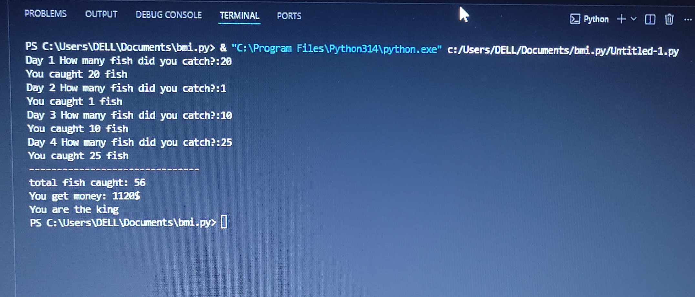

#Fish Income Calculator
โปรเจกต์เรียนรู้เกี่ยวกับภาษา Python โดยเบื้องต้นผ่านทางฟังก์ชัน และการวนลูป และ if, elif, else

##คุณสมบัติของโปรเเกรมนี้
- โปรแกรมคำนวณรายได้จากการตกปลาต่อเนื่อง 4 วัน
- คำนวณเงินอัตโนมัติด้วยฟังก์ชัน `get_fish_money` (ตัวละ 20$)
- มีระบบวิเคราะห์ความเทพจากผลรวมปลาที่ตกได้

##วิธีรันโค้ด
- คัดลอกโค้ดจาก VS Code ลง Github ลงGithub

##ผลลัพธ์การทำงาน (Output)

